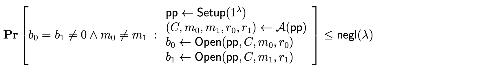
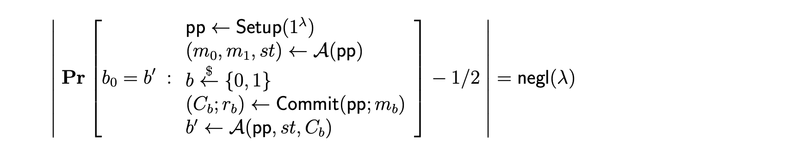

本文主要介绍构成SNARK的第一块基石commitment schema的一些相关概念，并介绍Pederson commitment， Merkle commitment ，用于plonk的KZG commitment以及用于halo的IPA commitment。
# 定义

Commitment schema 是一个三元组 $\tau=(setup, commit, open)$ 包括
- $setup(1^{\lambda}) \to pp$  引入一元秘密参数 $\lambda$ ，生成公共参数 $pp$ 或者被称为CRS
- $commit(pp;m) \to (C;r)$，根据m（消息）和r（随机值）作出承诺
- $open(pp; C; m; r) \to b ∈ {0, 1}$，打开承诺并验证

具有两种属性：
- binding 保护接收者的安全，即发送者对于同一个承诺不能有两个Opening

- hiding 旨在保护发送者（作出承诺的人），即在接受者看来，如果原始机密 $x_1 和x_2$ 不相同，那么 $Commit(x_1)和Commit(x_2)$ 不可区分。也就是说， $Commit(x)$ 不会泄漏 $x$ 的任何信息。
  

一般使用“Perfectly/Statistically/Computationally”来描述满足某个安全性的强弱：  

1.  "Perfectly"：表示即使拥有无穷计算力的机器也不可能打破相关安全性。
2.  "Statistically": 表示目前的计算机打破相关安全性的可能性可以被忽略。
3.  "Computationally"：表示目前的计算机在概率多项式时间内不会打破相关安全性。

不过， **一个 Commitment Scheme 不可能同时满足 Perfectly Hiding 和 Perfectly Binding**。 为什么呢？假设一个方案满足 Perfectly Hiding，那么一定存在多个 $x$，对应同一个 $Commit(x)$。否则，一个计算力无穷的机器通过穷举可以算出  $Commit(x)$ 背后的那个 $x$。而多个 $x$，对应同一个 $Commit(x)$ ，这显然违背了 Perfectly Binding。

# 常用Commitment schema

 预备知识
1. 离散对数假设 （Discrete Logarithm assumption，DLA）
   给定 $y \in \mathbb{G}$ ，在多项式时间内找到满足 $g^x = y$ 的 $x$ 是非常困难的。
2. Diffie-Hellman假设
     给定 $\mathbb{G}, g, g^x, g^y$ ，在多项式时间内计算 $g^{xy}$ 是非常困难的。
3. 双线性配对（Bilinear Paring）
     定义：
      - $\mathbb{G}$: 基群
      - $\mathbb{G}_T$: 目标群,
      - $p$ : $\mathbb{G}$ 和 $\mathbb{G}_T$ 的阶数
      - $g$ : $\mathbb{G}$ 的生成元
      - $e$ : 配对操作 $e : \mathbb{G} \times \mathbb{G} \to \mathbb{G}_T$
     配对操作满足双线性运算：

$$
	\forall P, Q, \in \mathbb{G} : e(P^x, Q^y) = e(P, Q)^{xy}
$$
   
 以上的 $\mathbb{G}$ 是乘法循环群。

 **Pedersen Commitment: Perfectly Hiding, Computationally binding**

一般有两种，基于离散对数或者椭圆曲线

- 基于离散对数 
1. 初始化阶段setup：选择阶为大素数 $q$ 的乘法群 $\mathbb{G}$、生成元 $g, h$ ，公开 $(g，h，q)$ 
2. 承诺阶段commit：选择随机数r作为盲因子，$x$ 为暂不公开的秘密值，计算承诺值 $com_f=g^xh^r \ mod \ p$ ，然后发送 $com_f$ 给接收者；
3. 打开阶段open：承诺方发送 $(x，r)$ 给接收者，接收者验证 $com_f$ 是否等于 $g^xh^r\ mod\ p$ ，如果相等则接受，否则拒绝承诺。

- 基于椭圆曲线  
    与上类似，有 $com_f=x*G+r*H$ ， $G$ 和 $H$ 是椭圆曲线的阶为大素数 $p$ 的点，并且关于 $H$ 的离散对数是未知的。 $x$ 是秘密值， $r$ 是来自于 $\mathbb{F}_p$ 的随机数。

Pederson Commitment 满足加法同态，因此可以用于一些恒等关系的验证，比如UTXO模型。

**Vector Commitment**

即向量承诺，可以对一个长度为 $q$ 的有序序列 $(m_1​,…,m_q​)$ 进行承诺，之后在特定的位置揭示承诺值（比如揭示第 $i$ 个位置的值为 $m_i$ ​）

**Merkle Commitment**  

$Commit$ : $Commit(pp;\overrightarrow{m})$  假设使用Hash作为哈希函数，对于叶子结点 $m_i$ ，计算 $h_i=Hash(m_i)$ ，对于内层节点，哈希值由两个子节点计算而来 $h_{i,j}=Hash(h_i, h_j)$。计算根节点的哈希值作为Commit： $C=root=h_{1,q}$
$Open$： $Open(pp, C, \overrightarrow{m}, i) \to b  ∈ \{0, 1\}$  
1. 证明者计算从 $h_i$ 到根节点的路径，输出证明: $\pi=(m_i, path)$
2. 验证者可以从path计算出root的哈希值，并与Commit比较

Merkle commitment的proof size和树的深度有关，对于二叉树，复杂度为 $log_2(n)$ ，对于 $k$ 叉树，复杂度为 $(k-1)log_k(n)$ 。

对merkle commitment的证明大小一个改进是使用Verkle tree。如果一个树包含 10 亿条数据，在传统的二叉 Merkle 树中进行证明将需要大约 1 KB，但在 Verkle 树中，此证明将少于 150B。

Merkle Commitment 是一种向量承诺。

**Polynomial Commitment（PCS）**  

多项式承诺是向量承诺(vector commitment)更一般的形式。  

对于一系列点 $(c_1,c_2...c_n)$, 一系列值 $(y_1,y_2...y_n)$，向量承诺问题就转换成多项式承诺问题。 

$$
P(c_i)=y_i ， for\ all\  i∈[1,...,n]
$$

我们将在part2 中继续讨论PCS的一种KZG承诺以及如何讲KZG承诺用做向量承诺。

参考文献
1. [Merkle proof](https://zhuanlan.zhihu.com/p/128567432)
    [零知识的Merkle Proof](https://zhuanlan.zhihu.com/p/128568771)
2. [深入理解Verkle Tree](https://zhuanlan.zhihu.com/p/500860920)
3. V神：[Verkle Trees](https://vitalik.ca/general/2021/06/18/verkle.html)
5. [PCS multiproofs using random evaluation](https://dankradfeist.de/ethereum/2021/06/18/pcs-multiproofs.html)
