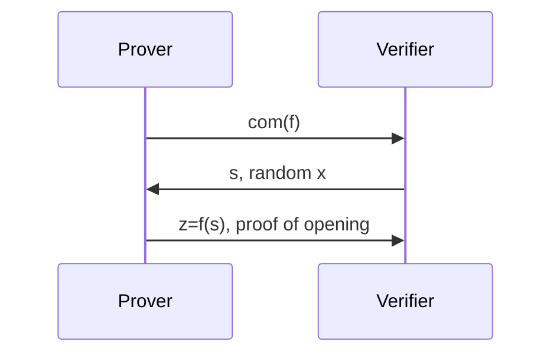
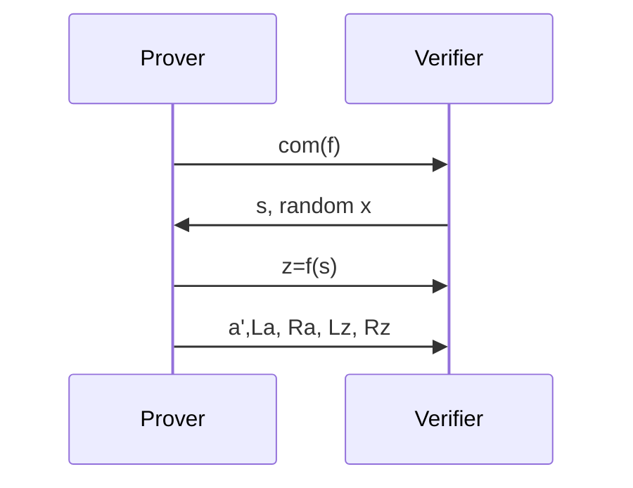
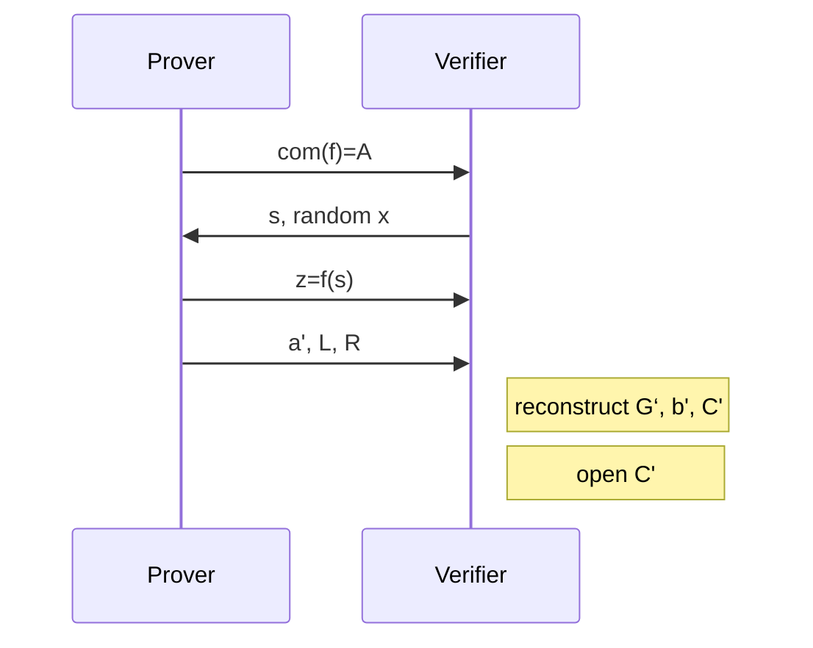
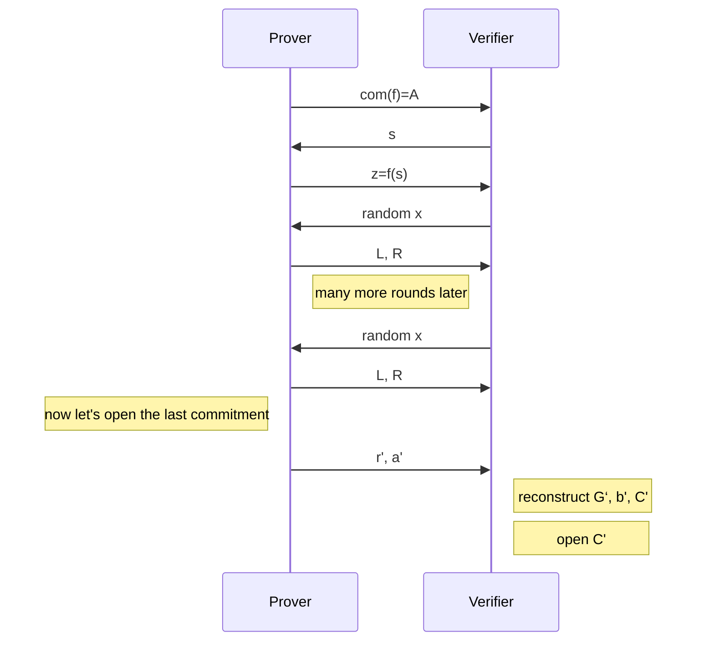

KZG证明需要信任设置，而BulletProofs是一种不需要信任设置的零知识证明算法，其核心是IPA（Inner Product Arguments）算法。

内积，即是计算两个向量中每个分量的乘积和：

$\vec{a}⋅\vec{b}=a_0b_0+a_1b_1+a_2b_2+⋯+a_{n−1}b_{n−1}$ , 记作： $⟨\overrightarrow{a}, \overrightarrow{b}⟩$  
其中 $\vec{a}=(a_0,a_1,…,a_{n−1}), \vec{b}=(b_0,b_1,…,b_{n−1})$ 。 
  
  
**将多项式转换成内积**

$$
\vec{f}=(f0,⋯,fn)\  such\  that\  f(x)=f_0+f_1x+f_2x^2+⋯+f_nx^n
$$

其中，
$$f(s)=⟨\vec{f},(1,s,s^2,⋯,s^n)⟩$$

只有Prover知道的秘密值： $\vec{a}=(a_1,a_2,a_3,a_4)$
公开值：
- $\vec{G}=(G_1,G_2,G_3,G_4)$, a basis for Pedersen hashing
- $C=⟨\vec{a}, \vec{G}⟩$ ， commitment
- $\vec{b}=(b_1,b_2,b_3,b_4)$, the powers of some value s such that  $\vec{b}=(1,s,s_2,s_3)$    
- the result of the inner product  $z=⟨\vec{a},\vec{b}⟩$  

___
NOTE: 以下主要参考了David的文章
___

**bulletproof**

简单的协议定义如下：

将此问题分解，取随机数$x$，并且令

$$
\begin{split}
\vec{a}'&=x\vec{a_L}+x^{-1}\vec{a_R} \\
\vec{b}'&=x^{-1}\vec{b_L}+x\vec{b_R} \\
\vec{G}'&=[x^{-1}]\vec{G_L}+[x]\vec{G_R}
\end{split}
$$

此时的Commit

$$
\begin{align*}
\vec{C'} & =⟨\vec{a'},\vec{G'}⟩ \\
        & = ⟨x\vec{a_L}+x^{-1}\vec{a_R}, [x^{-1}]\vec{G_L}+[x]\vec{G_R}⟩ \\
        & = (\vec{a_L}\vec{G_L}+x^2\vec{a_L}\vec{G_R}+x^{-2}\vec{a_R}\vec{G_L}+\vec{a_R}\vec{G_R}) \\
        & = ⟨\vec{a}, \vec{G}⟩+x^2\vec{a_L}\vec{G_R}+x^{-2}\vec{a_R}\vec{G_L} \\
        & = C+x^2L_a+x^{-2}R_a
\end{align*}
$$

此时的

$$
\begin{align*}
\vec{z'} & =⟨\vec{a'},\vec{b'}⟩ \\
        & = ⟨x\vec{a_L}+x^{-1}\vec{a_R}, x^{-1}\vec{b_L}+x\vec{b_R}⟩ \\
        & = (\vec{a_L}\vec{b_L}+x^2\vec{a_L}\vec{b_R}+x^{-2}\vec{a_R}\vec{b_L}+\vec{a_R}\vec{b_R}) \\
        & = ⟨\vec{a}, \vec{b}⟩+x^2\vec{a_L}\vec{b_R}+x^{-2}\vec{a_R}\vec{b_L} \\
        & = z+x^2L_z+x^{-2}R_z
\end{align*}
$$

一次迭代后的协议更新如下：

可以看到，改进前的协议，proof需要 $\vec{a}$ ， 改进后需要 $\vec{a'}, L_a, L_b, L_z, R_z$ , 加入 $\vec{a}$ 中有128个元素，则改进后的proof 需要64+2+2=68个元素。这个可以一直递归下去直到$a'$剩下一个元素。  
  
**Halo的优化**

Halo进一步减少了proof的大小。
设 $A=⟨\vec{a}, \vec{G}⟩$ , 定义

$$
C=A+zU=⟨\vec{a}, \vec{G}⟩+⟨\vec{a}, \vec{b}⟩U
$$

则

$$
\begin{align*}
C' &= ⟨\vec{a'}, \vec{G'}⟩+⟨\vec{a'}, \vec{b'}⟩U \\
&= [A+x^2L_a+x^{-2}R_a]+[z+x^2L_z+x^{-2}R_z]U \\
&= C+x^2(L_a+L_zU)+x^{-2}(R_a+RzU)
\end{align*}
$$

$$
\begin{align*}
L &=L_a+L_zU \\
R &=R_a+R_zU \\
C' &=C+x^2L+x^{-2}R
\end{align*}
$$

protocol更新为：

上面的protocol并没有加上零知识，在prover发送$a'$给verifier的时候就暴漏了知识。一个简单的方案就是更改之前的Pedersen Commitment，加上Hiding。

$$
C=A+zU+rH=⟨\vec{a}, \vec{G}⟩+⟨\vec{a}, \vec{b}⟩U+rH
$$

其中，H是另一个离散对数未知的生成元，r是prover生成的随机数。
L和R由$\vec{a}$生成，也暴漏了部分知识。用同样的方法进行隐藏：

$$
\begin{align*}
L=L_a+L_zU+r_LH \\
R=R_a+R_zU+r_RH
\end{align*}
$$

为了打开Commit，Verifier先计算 $C'$  

$$
C'=C+x^{-2}L+x^2R
$$

根据Prover发送的 $\vec{a'}$ 和 $r'$ ，计算

$$
\begin{align*}
⟨\vec{a'}, \vec{G'}⟩+⟨\vec{a'}, \vec{b'}⟩U+r'H \\
r'=\sum(r_{L_i}+r_{R_i})
\end{align*}
$$

Prover发送给Verifier的数据包括：
- 每一轮的 $L$ 和 $R$   
- 打开所需的 $a'$  
- 打开所需的 $r'$  

可以看出，这里仍然需要 $\vec{a'}$ 和 $r'$ ， Halo Paper中提供了一种基于Schnorr协议(a generalised Schnorr protocol)的方法使其不用揭示 $\vec{a'}$ 和 $r'$ 。

我们看下最终的protocol

Tips: 
**限制多项式的最大次数**
对于commit和evaluation做一个right shift

$$
\begin{align*}
right\_shift(f) &=x^{n-max}f \\
right\_shift(f(z)) &=z^{n-max}f(z) 
\end{align*}
$$
  
**对于多个多项式聚合proof**  

$$
⟨\vec{f}+v\vec{g}, \vec{x}⟩=f(x)+vg(x)
$$

**对于多个evaluation聚合proof**

$$
⟨\vec{f}, \vec{x1}+u\vec{x2}⟩=f(x_1)+uf(x_2)
$$  
**双重聚合**

$$
⟨\vec{f}+v\vec{g}, \vec{x1}+u\vec{x2}⟩=f(x_1)+vg(x_1)+u(f(x_2)+vg(x_2))
$$  

KZG承诺方案 和 Pedersen承诺与内积证明相结合的方案比较：

| |Pedersen+IPA|KZG|
|---|---|---|
|安全假设|离散对数|双线性群|
|可信设置|否|是|
|承诺大小|1个群元素|1个群元素|
|证明大小|2 log n个 群元素|1个群元素|
|验证|O(n) 群运算|1个配对|

TODO    Multiinear-IOP and vector-IOP（Verkle）

| IOP             | Commitment Scheme          | Examples                    |
| --------------- | -------------------------- | --------------------------- |
| Poly-IOP        | Poly-Commit                | Sonic, Marlin, Plonk        |
| Multilinear-IOP | Multilinear-Commit         | Spartan, Clover, Hyperplonk |
| Vector-IOP      | Vector-Commit (e.g Merkle) | STARK, Breakdown, Orion     |

参考文献：
1. Dankrad Feist：[Inner Product Arguments](https://dankradfeist.de/ethereum/2021/07/27/inner-product-arguments.html)
2. [Inner Product Argument (IPA) and a Polynomial Commitment Scheme](https://blog.lambdaclass.com/ipa-and-a-polynomial-commitment-scheme/)
3. * David Wong: [Inner product argument](https://hackmd.io/@mimoo/ByuE81Q0_)
4. Ying Tong: https://www.youtube.com/watch?v=RaEs5mnXIhY
5. Paper：[Bulletproofs: Short Proofs for Confidential Transactions and More](https://eprint.iacr.org/2017/1066.pdf)
6. Vitalik：https://twitter.com/VitalikButerin/status/1371844878968176647

